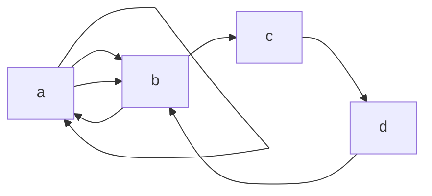
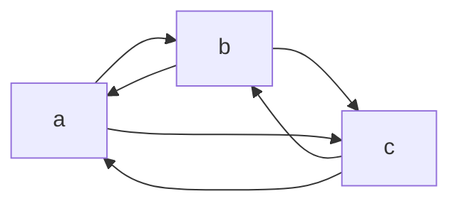
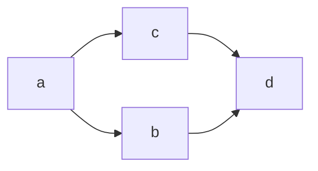
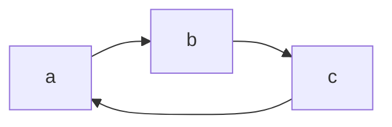
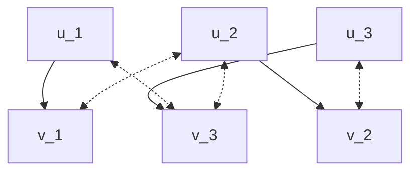
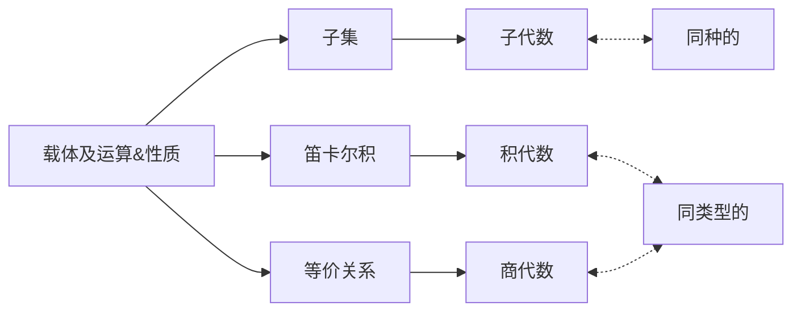

# 图论
##### 1. 无序积
A&$B = \{\{a, b\}\} | x \in A \wedge y \in B$
- 记{a, b}=(a, b)
- 允许 a = b
- (a, b) = (b , a)

##### 2. 有向图跟无向图
有向图 D=<V, E>
- V 不能为 $\emptyset$, 顶点集为 V (D)
- E $\subseteq V*V$, 边集（多重集）E (D)
例: D=<V, E>
V={a, b, c, , d, e}, E={<a, a>,<a, b>,<a, b>,<b, a>,<b, c>,<c, d>,<d, b>}

无向图的连通度
- 破坏连通性
p (G-V') > p (G)
G-V' 表示从图 G 中删除结点集合 V' 中的所有结点以及这些结点关联的所有边，既：
删除极小点割集并保证极小性的条件即可
p (G-E') > p (G) 删除一组边
G-E' 表示从图 G 中删除边的集合 E'中的所有边
删除全部的边割集里的边使得被删除后的图的联通分支数变大

度：
设 G=<V, E>为无向图，$v \in V$, 称所有边和 v 关联的次数之和为 v 的度数，简称度，记作 d (v)
度数为 1 的节点称为悬挂节点
G 的最大度：$\Delta G = max\{d (v)|v \in V\}$
G 的最小度：$\delta G= min\{d (v)|v \in V\}$
所有边的起点和 v 关联的次数之和为 v 的出度，记作 $d^+(v)$
所有边的终点和 v 关联的次数之和为 v 的入度，记作 $d^-(v)$
v 的总度数：$d (v)=d^+(v) + d^-(v)$

##### 3. 握手定理
定理 1：
设图 G=<V, E>为无向图或有向图，G 中有 n 个节点 $v_1, v_2, v_3,..., v_n$, 有 m 条边（无向或者有向），则图 G 中所有结点的度数之和等于边数的两倍，既：
$\sum\limits_{i=1}^n d (v_i) = 2m$

设 G 为任意一图，$V_1$ 和 $V_2$ 分别是图 G 中的奇数度数和偶数度数的结点集，根据定理得知
$\sum\limits_{v \in V_1} d(v) + \sum\limits_{v \in V_2} d(v) + \sum\limits_{v \in V} d (v) = 2m$
由于 $\sum\limits_{v \in V_2} d (v)$ 是偶数，2m 是偶数，所以 $\sum\limits_{v \in V_1} d (v)$ 是偶数. 对于每个 $v \in V_1$，d (v) 为奇数，所以 $V_1$ 中的结点数目必须为偶数，既度数为奇数的结点的个数必须为偶数

例:
已知图中 G 有 10 条边，4 个 3 度结点，其余结点的度数均<=2，问 G 中最少有多少个结点？
设 G 的结点数为 n
图 G 的结点总度数为 $\sum\limits_{i}d(v_i) \leq 3 \times 4 + 2 \times (n-4)$
由握手定理得知：$\sum\limits_{i}d (v_i) = 2 \times 10$
$\therefore \ 2 \times 10 \leq 3 \times 4 + 2 \times (n-4)$
$\therefore \ = n \geq 8$
所以图 G 中至少有 8 个结点

定理 2:
在所有有向图中，所有的结点的入度之和与所有结点的出度之和相等，都等于图中的有向边数

##### 4. 图的分类
- 无向完全图
定义：
设图 G=<V, E>是 n 阶无向简单图，若 G 中的任何结点都与其余的 n-1 个结点相邻，则称 G 为 n 阶无向完全图，记作 $K_n (n \geq 1)$
$\Delta (G) = \delta (G) = n-1$
n 阶无向完全图的边数 m=n (n-1)/2

- 有向完全图
设图 G=<V, E>是 n 阶有向简单图，若对于 V 中任意的两个结点 u 和 v，既有有向边 (u, v), 又有有向边 (v , u)，则称 G 为 n 阶有向简单图

每个结点的度都为  $\Delta (G) = \delta (G) = 2(n-1)$，边数 m 为 n (n-1)= 3 (3-1)= 6

- 设 G 为任意 n 阶无向简单图，则 $\Delta (G) \leq (n-1)$
3, 3, 2, 2, 1, 1 则正确

- 正则图 
设 G 为 n 阶无向简单图，若 $\forall v \in V, 均有 d (v) = k$, 则称 G 为 k-正则图

n 阶 k-正则图的边数 m=nk/2

- 环图
图 G=<V, E>的结点集 $V=\{v_1, v_2, ..., v_n\}(n \geq 3)$, 边集 $E=\{(v_1, v_2), (v_2, v_3), ..., (v_(n-1), v_n), (v_n, v_1)\}$, 则称 G 为环图，记为 $C_n$

$\Delta (G) = \delta (G) = 2$
环图 $C_n$ 的边数 m=n

- 轮图
给环图 $C_n (n \geq 3)$ 添加一个结点, 并把 $C_n$ 里的每个结点都连接起来称为轮图并记作 $W_n$
$\Delta (G) = n$, $\delta (G) = 3$
轮图 $W_n$ 的边数 m=2n

- 方体图
- 二分图
图 G=<V, E>的结点集 V 能划分称两个子集，$V_1$ 和 $V_2$, 使每条边有一个端点在 $V-1$ 中，另一个端点在 $V_2$ 中，则称为此图为二分图
$V_1=\{u_1, u_2,v_3\}$, $V_2=\{v_1,v_2,v_3\}$

- 完全二分图
如果 $V_1$ 中的每个结点都能与 $V_2$ 中的每个结点都关联，则称为完全二分图
若 $|V_1|=m, |V_2|=n$, 记作 $K_{mn}$

##### 5. 图的性质
回路：若一条通路的起点跟终点是同一点，称它是一条回路
定理 1：有向图 G 是强联通的当且仅当 G 中存在经过每个结点的回路
定理 2：有向图 G 是单项联通的当且仅当 G 中存在经过每个结点的通路

##### 6. 欧拉图&哈密顿图
欧拉图：
1.  从某一特定起点出发不重复的遍历完所有边的路径叫做欧拉路径，具有欧拉路径的图叫做半欧拉图
2.  从图中任意一点出发不重复地遍历完所有边并回到起点的回路叫做欧拉回路，具有欧拉回路的图即欧拉图

要想一个图 G 是半欧拉图，图 G 需要满足两个条件：
针对有向图来说：
1. 图 G 是连通的，不能有孤立的点存在。
2. 存在两个顶点，其入度不等于出度，其中一点出度比入度大 1，为路径起点，另一点入度比出度大 1，为路径的终点
针对无向图来说：
1. 图 G 是连通的，不能有孤立的点存在。
2. 度数为奇数的点的个数为 2，并且这两个点一定是路径的起点和终点

哈密尔图：
性质：
1. 连通, 度大于等于 2                                        
2. 哈密顿通路是度为 n-1 的基本通路, 其回路长为 n

##### 7. 平面图
设图 G=<V, E>是一个无向图，如果能把 G 画在平面上，使得除去结点处外，任意两条边都不想交，称图 G 为平面图
定理 1：一个连通平面图 G 的边数为 m，G 的边将 G 所在的平面划分成 f 个面，所有面的次数之和等于边数 m 的 2 倍，既：
$\sum\limits_{i=0}^{f} deg (f_i) = 2m$

定理 2：设图 G=<V, E>是任意的连通平面图，G 中有 n 个结点，m 条边，f 个面，则有公式          
n-m+f=2 成立，该公式称为欧拉公式
例：
图 G 有 30 条边，若 G 的边把图划分成 20 个区域，此图有多少个结点？
代入欧拉公式 n-m+f=2 = 30-20+2 = 12, 那么此图最少有 12 个结点

# 树
定义：
一个连通且无回路的无向图称为无向树
L (v)=从根到 v 上的路径
H (t)=顶点的最大层数
定理 1：
有 i 个分支点的 m 元正则树有 n=mi+1 个结点，1 是根结点
定理 2：
在高度为 h 的 m 元树里至多有 $m^n$ 片树叶

# 代数
##### 二元运算及其性质

表达式:
$\circ$ 是实数集 R 上的二元运算
$x \circ y = x+y-2xy$

##### 同态映射
$\large {V_1=\ <A, 0_1, 0_2, 0_3, 0_4, ..., 0_r>}$
$\large {V_2 = \ <B, 0_1', 0_2', 0_3', 0_4', ..., 0_r'>}$
$\large {f (0_i (x_1, x_2, x_3, x_4, ..., x_{k_i})) = 0_i' (f (x_1),  f (x_2), f (x_3), f (x_4), ..., f (x_{k_i}))}$
左边先运算在映射
右边先映射在运算
![[Pasted image 20221114224640.png]]

同态性质：
单同态
满同态 $V_1 \thicksim V_2$
同构 $V_1 \cong V_2$

##### 商代数
商代数：商代数就是把原代数抽象成一个比较小的系统
商代数的良性定义：
运算结果与参与运算元素的表示无关
对于任意元素 $o_i$, 设为 $k_i$ 元运算，$a_j \thicksim b_j$, j = 1, 2, 3, ..., $k_i$
则：
$\large {\overline{o_i}([a_1],[a_2], ..., [a_{k_i}])}$
$=\large{\lfloor o_i (a_1, a_2, ..., a_{k_i}) \rfloor}$
$\large {= [o_i (b_1, b_2, ..., b_{k_i})]}$
$\large {\overline{o_i}([b_1], [b_2], ..., [b_{k_i}])}$

##### 同态
同态基本定理：
设 $V_1 = <A, 0_1, 0_2, 0_3, ..., 0_r>$ 与 $V_2 = <B, 0_1', 0_2', 0_3', ..., o_r'$ 是同类型的代数系统，对于 $\large {i = 1, 2, 3, ..., r}$, $\large {0_i}$ 与 $\large {0_i'}$ 都是 $\large k_i$ 元运算，$f: \ A \longrightarrow B$ 是 $V_1$ 到 $V_2$ 的同态，关系 R 是 f 导出的 $V_1$ 上的同余关系，则 $\large {V_i}$ 关于同于关系 R 的商代数同构于 $V_1$ 在 f 下的同态像，既：
$V_1 | R \cong <f(A), 0_1', 0_2', 0_3', ..., o_r'>$
证明思路：
1）定义 h：$A/R \longrightarrow f (A), h([a])=f(a)$
2）验证 h 是良定义的 $[a]=[b] \Longleftrightarrow aRb \Longleftrightarrow f(a)=f(b)$
3）验证 h 是双射的
4）验证 h 是同态映射
考虑任意运算 $\large {\overline{o_i}}$, 设为 $k_i$ 元， $k_i > 0, i=1, 2, ..., r$
$\color{red}{\large {h(\overline{o_i}}([a_1],[a_2],[a_3], ..., [a_{k_i}]))}$ 因为要证明 h 是同态，所以先运算再映射
$=\color{red}{\large {h([0_i(a_1,a_2,a_3, ..., a_{k_i})])}}$ 商代数定义
$= \color{red}{\large {f(0_i,(a_1,a_2,a_3, ..., a_{k_i}))}}$ h 函数定义
$=\color{red}{\large {0_i'(f(a_1),f(a_2),f(a_3), ..., f(a_{k_i}))}}$ 同态定义</front>
$=\color{red}{\large {0_i'(h([a_1], h([a_2], h([a_3]), ..., h([a_{k_i}]))))}}$ h 函数定义
如果是 0 元运算 $[a] \in A/R$，则：
$\large {h ([a]) = f (a) = a'}$
且 $a'$ 是 $f(A)$ 中对应的 0 元运算
